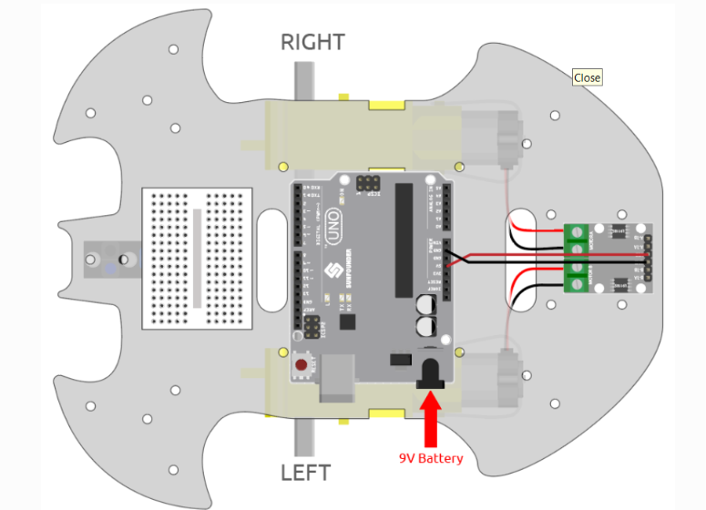
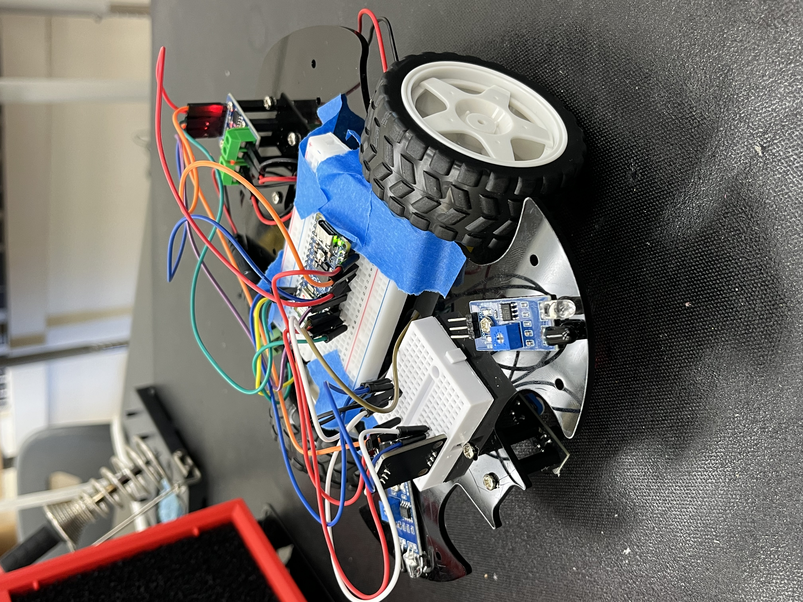
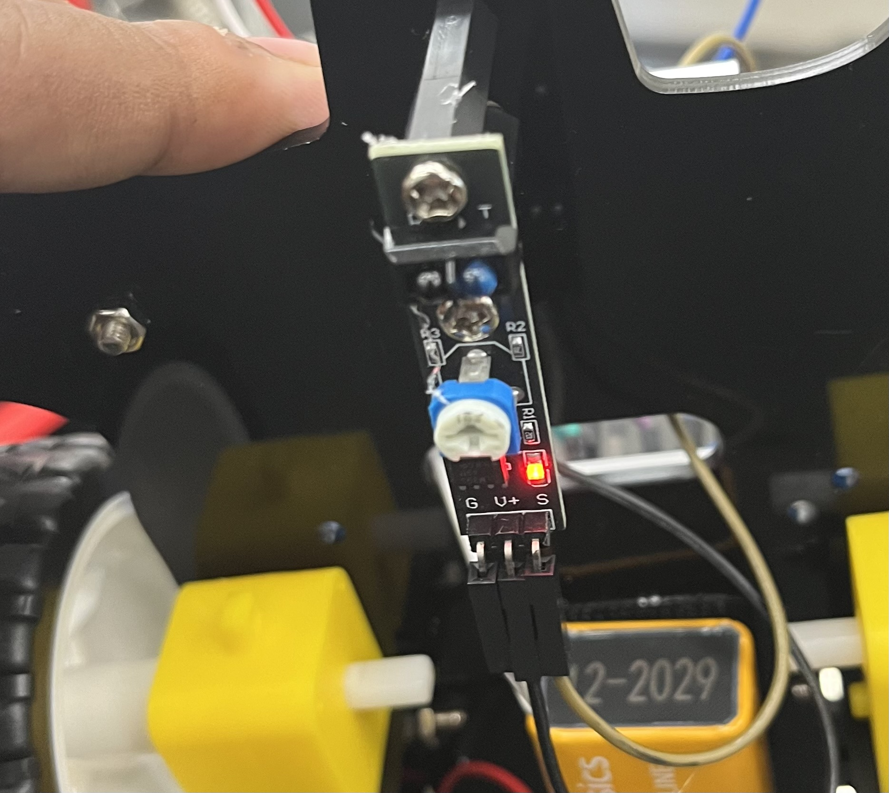
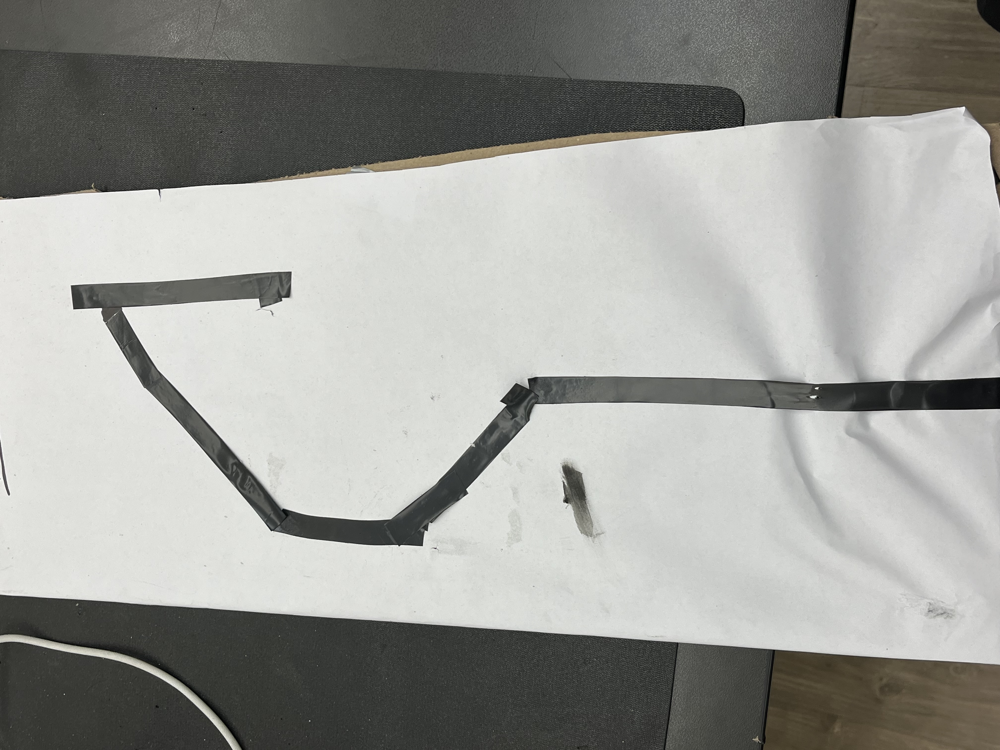
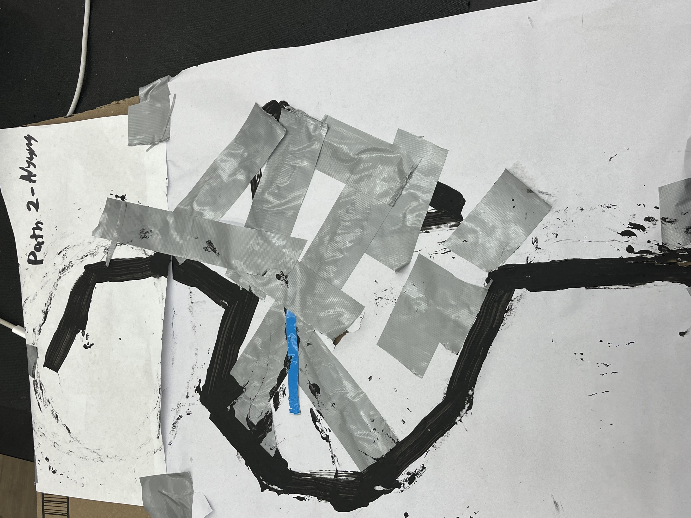
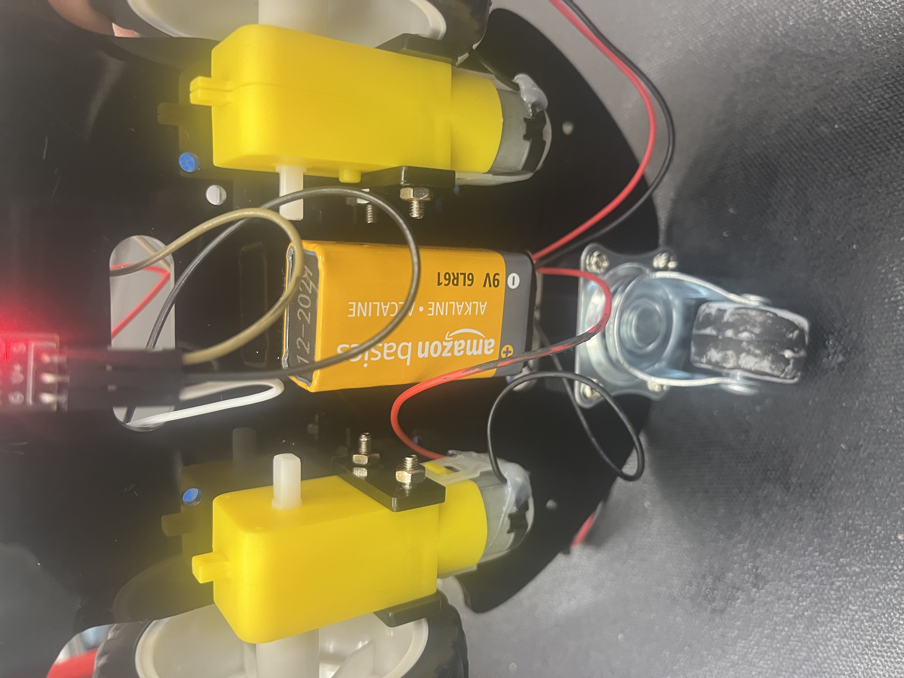

# Self Moving Car
In this project the car can move around with precoded instruction. It also uses sensors to prevent running into something.

You should comment out all portions of your portfolio that you have not completed yet, as well as any instructions:
```HTML 
<!--- This is an HTML comment in Markdown -->
<!--- Anything between these symbols will not render on the published site -->
```

| **Engineer** | **School** | **Area of Interest** | **Grade** |
|:--:|:--:|:--:|:--:|
| Aryaman C | W.Hopkins Middle School |Robotics| Incoming 8th Grader

**Replace the BlueStamp logo below with an image of yourself and your completed project. Follow the guide [here](https://tomcam.github.io/least-github-pages/adding-images-github-pages-site.html) if you need help.**


  
# Final Milestone
<iframe width="560" height="315" src="https://www.youtube.com/embed/ikT5m3mWRDI?si=RKFXuMvMvZSQmP-r" title="YouTube video player" frameborder="0" allow="accelerometer; autoplay; clipboard-write; encrypted-media; gyroscope; picture-in-picture; web-share" referrerpolicy="strict-origin-when-cross-origin" allowfullscreen></iframe>

In My final Mile Stone I accomplished:
- Getting my robot to be able to follow a black line
- Get portable line paths using cardboard peices and black tape/paint
**Challenges:**
- At first when making the line paths it was taped on to a table in my room. This meant it was not very portable.
- Solution:To solve this I made my own board out of carboard where I stuck on paper with a path. I made multiple so I can switch based on what I want.
- Another issue I faced was that it was not following the path and would sometimes start spinning
- solution:I relised this was becuase the robot's line following does not do well with angled turns less that 90 degree. To solve this I remade my paths to make sure all the turns are obtuse angle.


  

## Final Milestone code:
```c++

const int A_1B = 5;
const int A_1A = 6;
const int B_1B = 9;
const int B_1A = 10;

const int lineTrack = 2;

void setup() {
  Serial.begin(9600);

  //motor
  pinMode(A_1B, OUTPUT);
  pinMode(A_1A, OUTPUT);
  pinMode(B_1B, OUTPUT);
  pinMode(B_1A, OUTPUT);
  //line track
  pinMode(lineTrack, INPUT);
}

void loop() {

  int speed = 150;

  int lineColor = digitalRead(lineTrack); // 0:white  1:black
  Serial.println(lineColor); //print on the serial monitor
  if (lineColor) {
    moveLeft(speed);
  } else {
    moveRight(speed);
  }
}
void moveLeft(int speed) {
  analogWrite(A_1B, 0);
  analogWrite(A_1A, speed);
  analogWrite(B_1B, 0);
  analogWrite(B_1A, 0);
}

void moveRight(int speed) {
  analogWrite(A_1B, 0);
  analogWrite(A_1A, 0);
  analogWrite(B_1B, speed);
  analogWrite(B_1A, 0);
}


```


# Second Milestone

<iframe width="560" height="315" src="https://www.youtube.com/embed/SfPpuicSarg?si=kNcT2wdNzgdFr5zn" title="YouTube video player" frameborder="0" allow="accelerometer; autoplay; clipboard-write; encrypted-media; gyroscope; picture-in-picture; web-share" referrerpolicy="strict-origin-when-cross-origin" allowfullscreen></iframe>


For my 2nd Mile Stone I accomplished:
- The robot being able to turn in a 90 degree angle
- Being able to move in all direction,forward, bakcwards,left and right
- Being able to do a combined precided path, like forward, then turn left, then backwards, etc

**Challenges**
- Getting my Robot to be able to turn in a proper 90 degree angle
- Solution: In the code there was a delay funtion dictation how long the car was rotating. So I tested different time values until it was close enough to a 90       degree angle
- Moving in a straight line, and not go diagonel
- Solution:To counter this I tried a few things:
- I found the cause of it not going in a straight line was that one motor was slightly slower than the other. To try to fix this I tried replacing one of the     motors with another one. After about 3 more motors it was still not going in a stright line. So I moved to another solution
- I tried switching my pins to analog rather than digital. This is becuase while digital is either 1 or 0, analgo lets you set the speed of each motor from 1-255. After trying multiple values it still did not work
    In the end I was not able to find somthing that fully fixed this issue, so I plan to look more into this after Blue Stamp is over


## 2nd Milestone code:
```c++
const int A_1B = 5;
const int A_1A = 6;
const int B_1B = 9;
const int B_1A = 10;

void setup() {
  pinMode(A_1B, OUTPUT);
  pinMode(A_1A, OUTPUT);
  pinMode(B_1B, OUTPUT);
  pinMode(B_1A, OUTPUT);
}

void loop() {
  moveForward();
  delay(2000);
  stopMove();
  delay(500);

  moveBackward();
  delay(2000);
  stopMove();
  delay(500);

  turnLeft();
  delay(2000);
  stopMove();
  delay(500);

  turnRight();
  delay(2000);
  stopMove();
  delay(500);
}

void moveForward() {
  digitalWrite(A_1B, LOW);
  digitalWrite(A_1A, HIGH);
  digitalWrite(B_1B, HIGH);
  digitalWrite(B_1A, LOW);
}

void moveBackward() {
  digitalWrite(A_1B, HIGH);
  digitalWrite(A_1A, LOW);
  digitalWrite(B_1B, LOW);
  digitalWrite(B_1A, HIGH);
}

void turnRight() {
  digitalWrite(A_1B, HIGH);
  digitalWrite(A_1A, LOW);
  digitalWrite(B_1B, HIGH);
  digitalWrite(B_1A, LOW);
}

void turnLeft() {
  digitalWrite(A_1B, LOW);
  digitalWrite(A_1A, HIGH);
  digitalWrite(B_1B, LOW);
  digitalWrite(B_1A, HIGH);
}

void stopMove() {
  digitalWrite(A_1B, LOW);
  digitalWrite(A_1A, LOW);
  digitalWrite(B_1B, LOW);
  digitalWrite(B_1A, LOW);
}

```

# First Milestone

**Mile Stone Video**

<iframe width="560" height="315" src="https://www.youtube.com/embed/RFPTBMsZW78?si=fGp-N_cdQg-fXMuj" title="YouTube video player" frameborder="0" allow="accelerometer; autoplay; clipboard-write; encrypted-media; gyroscope; picture-in-picture; web-share" referrerpolicy="strict-origin-when-cross-origin" allowfullscreen></iframe>

**For my 1st Mile stone I acomplished:**
- Finsishing the robot building
- Wiring the motors
- Robot moving in a straight Line(Default with no code)

# Schematics 



# Bill of Materials

| **Part** | **Note** | **Price** | **Link** |
|:--:|:--:|:--:|:--:|
| TT Motor| Used to Move the robot| $2.95| <a href="https://www.adafruit.com/product/3777?gad_source=4&gad_campaignid=23986111167&gbraid=0AAAAADx9JvT4k6MoCV2B83Trz3U8EYZGQ&gclid=CjwKCAjwvNfSBhBiEiwAyaGMCSl_H-HDBxv6HDnP7aIOmZEnet5tMknBZBpHABU2blPnMRZw8CVvnRoCBcoQAvD_BwE"> Link </a> |
| Arduino  | Used the central hub where everthing plugs into| $59 | <a href="https://store-usa.arduino.cc/products/uno-q?utm_source=google&utm_medium=cpc&utm_campaign=US-UnoQ-Pmax&gad_source=1&gad_campaignid=23520659517&gbraid=0AAAAACbEa84z8Do-rnXVb8l9wLlVGwN98&gclid=CjwKCAjwvNfSBhBiEiwAyaGMCZLjVVoCI1ljG9uYIM4YEbrWuJz3TTL7_yHj3rsWppnJKXVQaxCePxoCJ1gQAvD_BwE"> Link </a> |
| Bread Board | Used as an extention for more ports | $2.95 | <a href="https://ezsbc.shop/products/small-breadboard?variant=44055834067099&country=US&currency=USD&utm_medium=product_sync&utm_source=google&utm_content=sag_organic&utm_campaign=sag_organic&utm_source=google_ads&utm_medium=cpc&utm_campaign=Shopping-CatchAll-US&adgroupid=177086488447&utm_term=&device=c&gad_source=1&gad_campaignid=21645735010&gbraid=0AAAAACSHmfwmUsLFqyBX9koiZ4AMmQCgA&gclid=CjwKCAjwvNfSBhBiEiwAyaGMCVZNsqYJIX5y4fgS8evHnH9cqMwQruy2-yozdIUys0ikaTVyTrYvOBoCD70QAvD_BwE"> Link </a> |


# Photo Gallary

**Project Photo**


**Line Tracking Sensor**


**Path 1 for Line Following**


**Path 2 for Line Following**


**TT Motors on my Robot**


# Other Resources/Examples
- [Example 1]<a href="https://trashytuber.github.io/YimingJiaBlueStamp/](https://docs.sunfounder.com/projects/3in1-kit-v2/en/latest/car_project/car_assemble.html"?

To watch the BSE tutorial on how to create a portfolio, click here.
